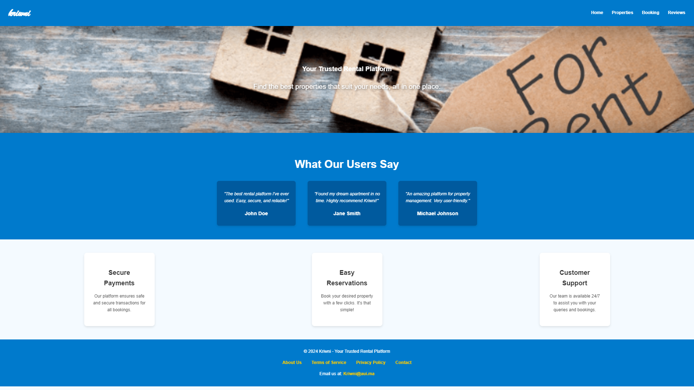
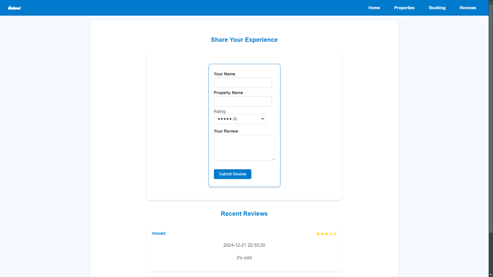

# Kriwni - House Rental System

**Kriwni** (meaning "Rent Me" in Moroccan) is a web-based house rental system designed to simplify the process of booking properties for tourists. The platform allows users to browse through various property types, book their stays, view their booking history, and leave reviews for the properties they've rented.

---

## Features

- **Property Browsing**: View a wide selection of properties categorized by type.
- **Booking Management**: Book properties for specific periods and track past bookings.
- **Reviews**: Leave reviews for properties you've rented to help future users.
- **User-Friendly Interface**: A simple, intuitive design built with PHP and styled using CSS.

---

## Target Audience

The primary audience for **Kriwni** is tourists who are looking for an easy and reliable way to rent properties for their vacations or business trips.

---

## Technologies Used

- **PHP**: Backend development.
- **MySQL**: Database management.
- **CSS**: Styling for a clean and attractive user interface.

---

## Deployment

- First Download and Install :

    + MySQL Workbench: 
        https://dev.mysql.com/downloads/file/?id=534624

    + PHP (Non-Thread Safe zipped folder):
        https://windows.php.net/download/

- Add the path to "both" folders to your system “Path” environment variable

- Import & Create the Database:

     + Locate the provided kriwni.sql file in the project.
     + Run the provided code in the sql file into Workbench

- To deploy this project locally run (inside the project folder "kriwni")

```bash
  php -S localhost:8000
```
- Then in your browser search bar type

```bash
  http://localhost:8000/kriwni/
```

---

## Future Plans

Planned improvements for **Kriwni** include:

- Enhanced filtering options for properties (e.g., by location, price range, or amenities).
- User authentication and account management.
- Real-time property availability updates.
- Integration with payment gateways.

---

## Screenshots

Homepage:



Properties:


My Bookings:


Reviews:



---

## Credits

Developed by: [@ReTr0Seven](https://www.github.com/ReTr0Seven)

Email: ip.retr07.user@gmail.com